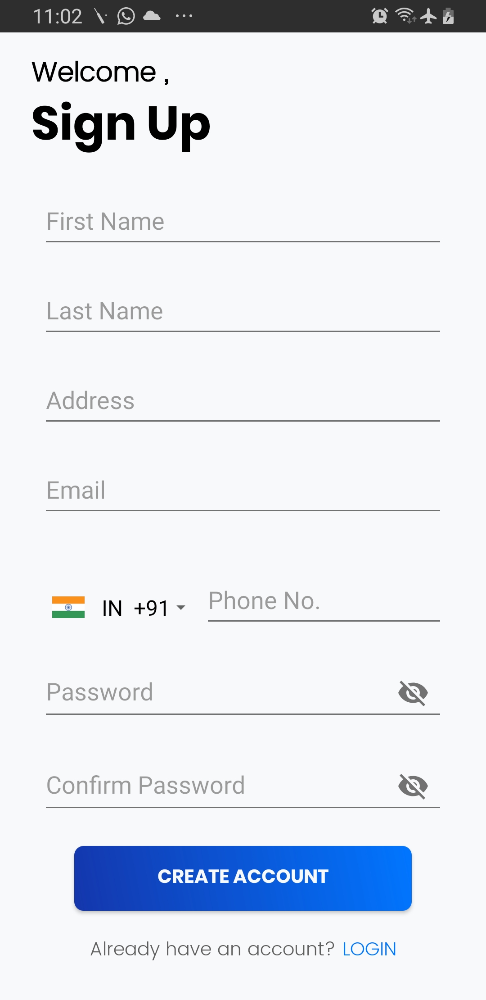

# ANDROID-ANKIT-SINGH
## ABOUT THE APP
This is a <b>Kotlin<b> based native application which uses <b>SQLite Database<b> and <b>recycler view, card view,edit text ,shared preferences and many more.. <b>
  
### Splash screen
The first screen is the splash screen from this screen you can navigate to login screen or the sign up screen

### Signup screen
The application  contains the signup screen in which a user has to enter his or her details to get registered the basic validation is provided in the application it also has an option where in if you already have the account you can login from there as well .The signup screen has password checking that is the password you entered and then again entering the same password to confirm the password should contain at least 1 uppercase charecter ,1 lowercase cahrecter and 1 number and should not be less than 8 ,also <b> to avoid data duplication<b> email id is made primary  key that is once an email id is taken and you enter the same id while doing the new registration then it would show a toast saying <b> email id already exists<b>.
  
  

  

  
 ###  Login screen
the application contains the login screen on this screen you just need to enter your email and password and it does a<b> background check <b> with the database if the record dosen't exists then it gives a<b> prompt that emil id or password entered is wrong<b> basic validation is also included.The go back button would take you to the splash screen.
  
  

  
  ### Home screen 
  This screen contains the list of data items for which the api was provided the data is parsed using <b>retrofit 2, recycler view , cardview<b> and have used relative layout for the same including<b>Glide<b> for image loading also have provided random colors so the <b>space where the images are to be stored different colors for different card views till the image does not get loaded from the database <b> I have also provided a <b>sorting<b> feature using <b> shared preferences<b> and you can sort the data by <b>first name or last name<b> Also when there is<b> no connectivity a view is provided with a button so that by clicking on that button network request can be performed<b> again ,also by long clicking on a cardview a <b> alert dialog<b> appears where you get to delete the item or not if you click on yes it gets deleted otherwise it dosen't.
  
  ### Home

  
  ### long click deletion
  

  
  ### before sorting

  
   ### After sorting

  
  
  
  ### Hamburger screen
  This is the navigation drawer which basically consist of two options first of <b>profile<b> and of<b>logout<b> if you click on profile it will show you all the details that you entered at the time of registration this values are retrived from the <b>SQLite Database<b> it has an option of go back where in by clicking on it you would be redirected to home screen The second option is of logout by clicking on logout an alert box will appear for confirmation once you confirm it you would get logged out of the system and get redirected to login screen.
  

  
  
  
